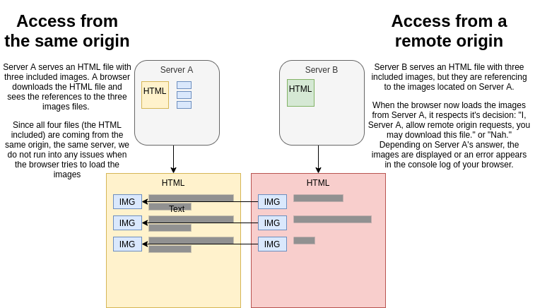

# The Why: A small primer

The internet is basically a bunch of servers, each serving resources. Interested parties can request those resources and the server always responds with a status code and - if the request is successful - with the resource itself. This is basic [Hypertext Transfer Protocol (HTTP)](https://www.wikipedia.org/wiki/Hypertext_Transfer_Protocol).

Using images within Foundry is subject to the very same principles. If you are using vtta-ddb or vtta-tokens chances are good that you are accessing images **not served by your Foundry server, but on a remote one**.

## When do we download images?

- You are using vtta-tokens to create a token for your character. You are using the "Add an image from a Remote URL"-tool to add a new image layer to your composition. After inserting the URL pointing to the image, the image is requested from the server and drawn onto the token stage.
- You are browsing on D&D Beyond and find an interesting monster which you want to import. It has an image attached to it, and vtta-ddb is requesting the image for you to store it on your Foundry VTT server.
- You are preparing to run the _Lost Mine of Phandelver_ adventure and start the import of that module from D&D Beyond. All related battlemaps are downloaded by vtta-ddb and stored on your Foundry VTT server for you.

## And what is the issue here?

The issue is Cross-Origin Resource Sharing (CORS). If you request an image from a server, it may respond with the decision that you may not load this resource. Let's look at that in detail:

Depending on the origin of the request, the server might either allow access to a resource or not. And it's the browser honing this decision and showing an error message instead of downloading the image.

## What is CORS good for?

It's great to make it at least more difficult to load all images, stylesheets and scripts from e.g. facebook.com, build a rogue website (fakebook.com?) that looks and behaves identical to facebook.com and grab your personal details while you are accidently the wrong website. While this is most certainly a great thing to implement - oh my, the way my mother uses the internet, she would probably sell their house accidently on a russian warez site while thinking she is playing Farmville on Facebook - CORS is hardly securing us on our use-case for any harm. If we run into a CORS rejection, we can manually download the image and then upload it to our Foundry Server. If something malicious is within that image, you would not know that in either case.

## Are all resources CORS protected?

No, they aren't. D&D Beyond surely implemented that (and it's not hard to configure), but other than that, it really depends on the server admin to either configure or forget about CORS. It is really hard to tell any percentage.

# How can we access CORS-protected resources?

I said before that your browser is honing the servers decision and the CORS flag. We can use that to our advantage and implement a proxy that is requesting the resource on our behalf - and which is not running inside a browser. There are two possible solutions:

## The flesh-and-bones-Proxy

The lengthy workaround is to not use any images directly from remote servers, but to download them locally first: If you see an image you want to use within Foundry, download it to your local harddrive and then manually upload it to your Foundry VTT server. You are basically your own proxy in flesh and blood, how awesome is that?

## Hosting your own proxy server

Two simple steps:

1. Write a proxy that accepts request from your Foundry server, relays them to the remote server, downloads the image and forwards it back to your Foundry server.
2. Configure vtta-core to use your own proxy server instead of the VTTA.io default ones. The configuration requires you to run a command against the Foundry VTT server by opening the console.log. I guess that most of the people will not run their own custom proxy and therefore a configurable UI game setting was not warranted to implement.

   Please follow the code comments and the readme on the repository in order to learn how to configure your proxy.

3. Start that proxy whenever you need it. If you are running Foundry on your regular computer, you can start the proxy whenever you run your session or prepare for them, and shut it down along Foundry VTT when you are done with your prep/session.

You can find a stripped-down version of the proxy that I am using for vtta.io on [Github](https://github.com/VTTAssets/image-proxy). As with everything, I am using Javascript/ node.js to launch the server, so setup and configuration should be a breeze. If you want to go that route, you will definitely find the comments within the source code extremely helpful to get started.

## Every Patreon can use the VTTA.io proxy server

The reason I am not willing to host a publicly available proxy server with anonymous access are depicted in a video found on my [Youtube channel](https://www.youtube.com/watch?v=C1wD-3jYGy4). Being able to restrict access to a certain user or certain user groups requires accounts and/or credentials - something that was already in place for checking patreon status. So instead of reinventing the wheel I have finally found a benefit for the neglected 2$ tier: Every patreon has access to the vtta.io proxy servers, one in each datacenter. This allows quick response times and sturdiness, and no setup on your behalf.
