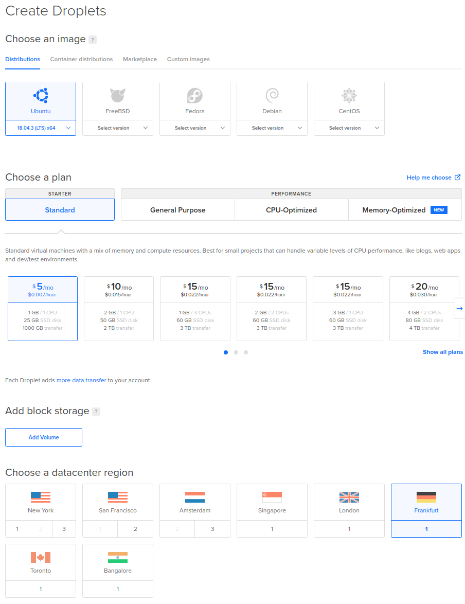
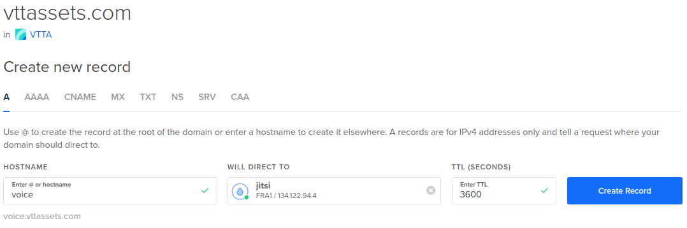
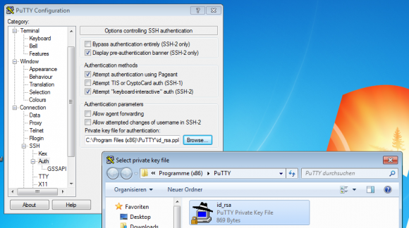
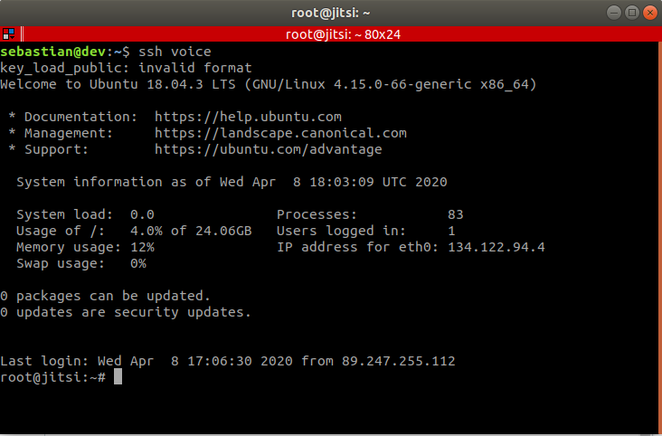
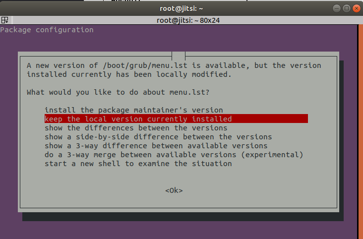
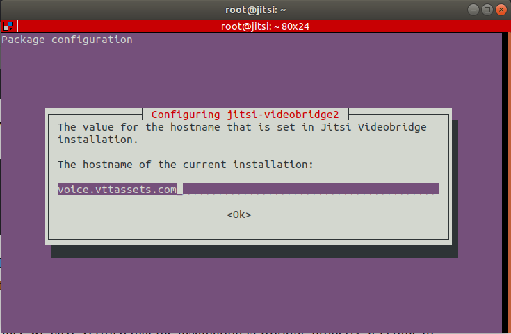
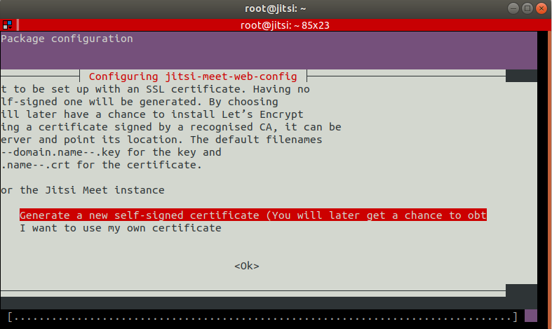
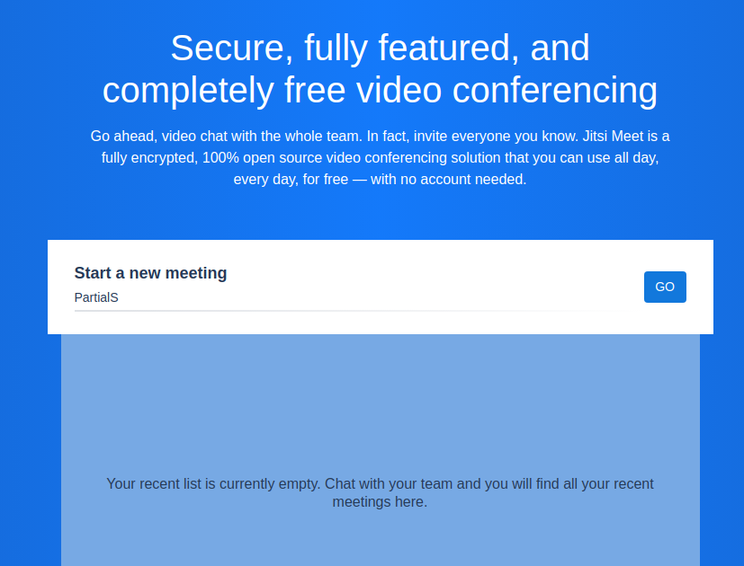
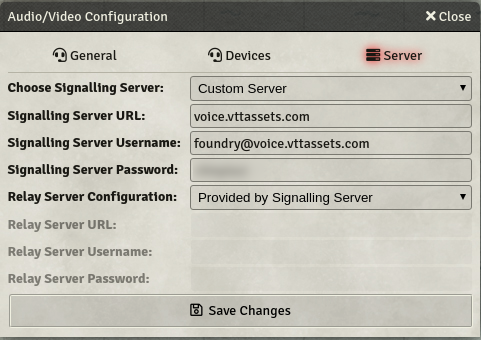
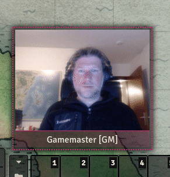

<div class="ui segment">
<p>This guide is using <a href="https://m.do.co/c/ea9292afc8cc">Digital Ocean</a> as a low-cost, but still viable webhoster of choice. I am used it for every web project I did in the last couple of years and I love the easiness of creating and disposing new Droplets, as they call their Virtual Machines.</p>
<p>If you are already using a different hoster, the described procedure should be easy enough for you to adjust.
<b>Please note: </b> If you are using the link above to sign up, you will get 100$ in "try me"-money. If you spend 25$ of your own money some time later, I will get that 25$, too. If you think that this is fishy, then please just <a href="https://www.digitalocean.com/">go to their website</a> and check them out without the referral link.</p>
</div>

# Preparing your droplet

Jitsi installs fine on a very small droplet, I am using the smallest one that suits my needs perfectly. This might depend on the size of your group, but you can increase the droplet size later on very easily in case you really need a better performing CPU or more RAM, down-sizing is (I think) not that simple.

The [most tiny droplet](https://cloud.digitalocean.com/droplets/new?size=s-1vcpu-1gb) is still good enough for one role-playing group of friends. You could choose a number bigger to run Foundry alongside it, but I think even both software product will run fine on the smallest droplet if your average group size does not exceed four or five people - tell me with how many users you are running that combo and I will adjust that with a recommendation based on real-world usage.

All you need to do is to choose a datacenter region that is located near you in order to reduce latency and therefore audio/video quality later on. I am using Frankfurt, but you will probably use another datacenter location.

Furthermore, we will be using Ubuntu 18.4.3 LTS x64 as our operating system because I know that best, your mileage may vary.



I recommend creating SSH keys and adding them to access your droplet, you can find [information on how to do that for Windows and Linux directly on the Digital Ocean knowledge base](https://www.digitalocean.com/docs/droplets/how-to/add-ssh-keys/).

## Connecting a domain: A-Records and CNAMEs

I am buying my domains at [Go Daddy](https://www.godaddy.com/) (I don't get the name, too, perhaps an inside joke?) and [namecheap](https://www.namecheap.com/). You can then add your new domain to Digital Ocean, where you can manage it, ie. by creating an A-record or CNAME to point to your newly created droplet.
Can't follow? Domain Name System (DNS) translates IP addresses into names that humans can remember way better. When you own a domain, your hoster will grant you access to a GUI where you configure the relation between domain/subdomain names and IP adresses. Those are just entries in a global phone book and because you own your domain, you can configure the phone numbers of that domain and the changes will be available everywhere in the world. This replication can take up to two days, so sometimes a little patience is involed in configuring domains.

The difference between A-records and CNAMEs is very easy to understand: An A-record points to an IP address directly, while a CNAME is an alias to an existing A-Record, e.g. "vttassets.com" points to 134.122.71.147 and is therefore an A-record, while "get.vttassets.com" points to "vttassets.com". In case I ever need to relocate to another droplet or a different hoster altogether, it is enough to change the entry for "vttassets.com" and all other entries are following automatically.

Go to your domain management menu, select your domain you registered at Digital Ocean and create a new A-Record. I am using "voice" in the hostname section, then I do select the droplet I just created in the "Will Direct To" field next to it. Hitting "Create Record" adds that entry to your DNS and your droplet will be reachable through the domain name (sometimes after a bit of replication which might take some time, so please be patient).



## Connecting to your droplet: ssh and initial setup

SSH is something that is used very commonly in the Linux world and if you are a Windows uses, there is a good change that you never came into contact with that before. I would recommend [downloading putty](https://www.chiark.greenend.org.uk/~sgtatham/putty/latest.html) to connect to your server, it's a tiny tool that will serve you fine. Remember to add your SSH private key you generated earlier when trying to connect to your droplet for the first time.



Connect to your configured domain name on port 22, selecting "ssh" as the connection method. You can name the connection on the first screen and hit save to save the set SSH key, servername and other configured settings for easy access later on, you will need that a couple of times.

After you successfully connected, you will be greeted by the black and white shell. I you never worked with a shell this might be a bit intimitating at first, but with a little help you will feel right at home. Speaking of home, let's secure our new digital home first.



## Changing the ssh port and enabling the firewall

Your publicly accessible server is probably already probed by evil-doers, and while you are using a SSH key to access it, it is still a good idea to change the default ssh port from the default port 22: If one script kiddy fails, you still have won a little battle.

The command prompt shows you the name of the currently logged in user and the name of the server (droplet) you created, then a hash (#), then your blinking cursor. Commands are run by typing in the command and hitting enter.

In my example, I am the user root and my server is named jitsi. Let's change into the directory /etc/ssh and re-configure the default ssh port:

```terminal
root@jitsi:~# cd /etc/ssh
root@jitsi:/etc/ssh# nano sshd_config
```

`cd` stands for change directory, and `nano sshd_config` opens up the nano text editor with the file /etc/ssh/sshd_config. Somewhere on the first lines, you will see this

```bash
# Port 22
```

This line is commented out by the prepended hash. Remove the hash and set the port number to something different, e.g. 2218. Save the file with CTRL-S and return to the shell with CTRL-X.
Restart the ssh server by running

```terminal
root@jitsi:/etc/ssh# service sshd restart
```

Let's configure the firewall to initially only allow your new ssh connection and your server is way more secured than a minute ago:

```terminal
root@jitsi:/etc/ssh# ufw allow 2218/tcp
Rules updated
Rules updated (v6)
root@jitsi:/etc/ssh# ufw enable
Command may disrupt existing ssh connections. Proceed with operation (y|n)?
```

Replace the `2218/tcp` with the port you chose earlier for your ssh port in `/etc/ssh/sshd_config`! When you confirm the enabling of ufw (Uncomplicated FireWall), you will be disconnected form your current session, because you connected to port 22, remember? Just restart the connection using putty and change the port there, too. You will be able to re-login again successfully.

The last thing we will be doing is updating the system by installing the latest patches:

```terminal
root@jitsi:/etc/ssh# apt-get update && apt-get upgrade -y && apt-get dist-upgrade -y
```

When asked if you want to change certain components, choose the keep the existing installation intact:



This might take a moment. Afterwards, we are prepared to actually install Jitsi and use it in our Foundry installation later on.

## Installing Jitsi

Let's install nginx first, a webserver that is used to serve the conference to you and your users:

```terminal
root@jitsi:~# apt install nginx -y
```

Afterwards, we can actually install Jitsi. We need to add the repository to our system first and then install the necessary package:

```terminal
echo 'deb https://download.jitsi.org stable/' >> /etc/apt/sources.list.d/jitsi-stable.list
wget -qO -  https://download.jitsi.org/jitsi-key.gpg.key | apt-key add -
apt update && apt install jitsi-meet -y
```

During installation, you will be asked which hostname you want to use for Jitsi. Here, you will insert the A-record/ CNAME you created earlier in the domain management GUI. I will be using voice.vttassets.com.



We will use the self-signed certificate for now, but will update it by creating an officially signed one by Let's encrypt later on:



Use the self-signed certificate for now: Getting the official certificate is real easy in a second

Make sure your server is really reachable using your domain name by pinging it from your home computer: Open up a shell or command line, and enter ping voice.vttassets.com, of course replacing voice.vttassets.com with your domain name. If you get a successful answer, open up
port 80/tcp for the automatic certificate generation:

```terminal
ufw allow 80/tcp
ufc allow 443/tcp
```

Now run the script to generate your officially signed Let's encrypt certificate:

```terminal
/usr/share/jitsi-meet/scripts/install-letsencrypt-cert.sh
```

You will need to enter an email address to get important notifications for that certificate, it is safe to use an email you are actually monitoring, there is no spam involved. You will see (probably a lot more ouput since I forgot to open up the ports above on my first run):

```terminal
-------------------------------------------------------------------------
This script will:
- Need a working DNS record pointing to this machine(for domain voice.vttassets.com)
- Download certbot-auto from https://dl.eff.org to /usr/local/sbin
- Install additional dependencies in order to request Let’s Encrypt certificate
- If running with jetty serving web content, will stop Jitsi Videobridge
- Configure and reload nginx or apache2, whichever is used

You need to agree to the ACME server's Subscriber Agreement (https://letsencrypt.org/documents/LE-SA-v1.1.1-August-1-2016.pdf)
by providing an email address for important account notifications
Enter your email and press [ENTER]: vttassets@gmail.com
Saving debug log to /var/log/letsencrypt/letsencrypt.log
Plugins selected: Authenticator webroot, Installer None
Obtaining a new certificate
Performing the following challenges:
http-01 challenge for voice.vttassets.com
Using the webroot path /usr/share/jitsi-meet for all unmatched domains.
Waiting for verification...
Cleaning up challenges

IMPORTANT NOTES:
 - Congratulations! Your certificate and chain have been saved at:
   /etc/letsencrypt/live/voice.vttassets.com/fullchain.pem
   Your key file has been saved at:
   /etc/letsencrypt/live/voice.vttassets.com/privkey.pem
   Your cert will expire on 2020-07-07. To obtain a new or tweaked
   version of this certificate in the future, simply run certbot-auto
   again. To non-interactively renew *all* of your certificates, run
   "certbot-auto renew"
 - If you like Certbot, please consider supporting our work by:

   Donating to ISRG / Let's Encrypt:   https://letsencrypt.org/donate
   Donating to EFF:                    https://eff.org/donate-le

Configuring nginx
Configuring turnserver
```

Confirm that your installation is running by opening up your configured domain with any browser, make sure to use https and not http!



We still need to open up the communication ports used by Jitsi in order to actually access the server with audio and video:

```terminal
ufw allow 10000:20000/udp
ufw reload
```

## Enabling Cross-Origin requests, read: Allow Foundry to connect

In order to prepare the usage within Foundry, we will configure one option with nginx, the webserver: If you are hosting Foundry not from this droplet, but form a different location (perhaps even your local home computer), you need to enable Cross-Origin Resource Sharing (CORS). That means this droplet needs to tell incoming clients "Yes, I allow this connection, please continue", in less technical words.

Let's open the nginx configuration file with our favorite text editor, nano (sorry vim). Please note: Your filename contains your domain name, so make sure to open up the correct one:

```terminal
nano /etc/nginx/sites-available/voice.vttassets.com.conf
```

Scrolling down, you will find a section named BOSH:

```terminal
# BOSH

location = /http-bind {
    proxy_pass http://localhost:5280/http-bind;
    proxy_set_header X-Forwarded-For $remote_addr;
    proxy_set_header Host $http_host;
}
```

Add the CORS options to that section, delimited by braces ({ ... }):

```terminal
# BOSH

location = /http-bind {
    proxy_pass http://localhost:5280/http-bind;
    proxy_set_header X-Forwarded-For $remote_addr;
    proxy_set_header Host $http_host;
    add_header 'Access-Control-Allow-Origin' '_';
    add_header 'Access-Control-Allow-Credentials' 'true';
    add_header 'Access-Control-Allow-Methods' 'GET,HEAD,OPTIONS,POST,PUT';
    add_header 'Access-Control-Allow-Headers' 'Access-Control-Allow-Headers, Origin,Accept, X-Requested-With, Content-Type, Access-Control-Request-Method, Access-Control-Request-Headers';
}
```

**Note**: The line `add_header 'Access-Control-Allow-Origin' '*';` allows all origins, depicted by the star: `'*'`. If you want to be more restrictive, and perhaps have set a domain name to your Foundry host, you can specify that domain name. I could, e.g. use
add_header `'Access-Control-Allow-Origin' 'game.vttassets.com';`
to only allow my own Foundry installation to connect to this Jitsi server. We will refine access rights in a second, but it's still worth restricting it as much as possible here, too.

Save the file (CTRL-S) and close nano (CTRL-X), then restart nginx to activate the changes:

```terminal
service nginx restart
```

Jitsi is installed, but needs a little more configuration: Everyone can use your new Jitsi server for their own conferences, and that is something you might now want. So let's enable authentication in the last step.

## Enable Authentication within Jitsi

> Having a publicly available conference software is something that is greatly sought after in these days. Still, you might want to secure access to your family and closest friends. The great thing about Jitsi is that only the one creating the conference needs to be a registered user, and whenever a conference is created, everyone can connect to the publicly available URL - it is really a great software to use to keep in touch with your loved ones.

The following steps are greatly reduced in complexity by the formidable scripting of [Andrea Giacobino@noandrea](https://dev.to/noandrea) from his article [Self-hosted Jitsi server with authentication](https://dev.to/noandrea/self-hosted-jitsi-server-with-authentication-ie7). Please give him some love while you are there!

First, we will need to create a bash variable with our domain name we are using for Jitsi. Andrea uses that variable in the following three scripts, making the whole process dead simple. I am using voice.vttassets.com, please replace that with your own domain name you chose earlier:

```terminal
export JITSI_DOMAIN="voice.vttassets.com"
```

Then run the three scripts to change the files

```terminal
curl  https://gist.githubusercontent.com/noandrea/5ff6b212273af95103996c0e71f0cdf2/raw/22965f246c59bc149245554b6079db97794425bd/apeunit.test-config.js -s | \
sed  "s/apeunit.test/$JITSI_DOMAIN/g" \
> /etc/jitsi/meet/$JITSI_DOMAIN-config.js
curl https://gist.githubusercontent.com/noandrea/5ff6b212273af95103996c0e71f0cdf2/raw/bb3e8a65582882dd3aeb4624d2522b244b949855/apeunit.test.cfg.lua -s | \
sed  "s/apeunit.test/$JITSI_DOMAIN/g" | \
sed  "s/JICOFO_SECRET/$(grep -e '^JICOFO_SECRET=.*' /etc/jitsi/jicofo/config | cut -d '=' -f2)/g" | \
sed  "s/TURN_SECRET/$(< /dev/urandom tr -dc _A-Z-a-z-0-9 | head -c${1:-8})/g" \
> /etc/prosody/conf.avail/$JITSI_DOMAIN.cfg.lua
echo "org.jitsi.jicofo.auth.URL=XMPP:$JITSI_DOMAIN" \
>> /etc/jitsi/jicofo/sip-communicator.properties
```

Lastly, we do create the first user (of many?) that can use our new Jitsi server as a conference host:

```terminal
prosodyctl register [username] $JITSI_DOMAIN [password]
```

for example:

```terminal
prosodyctl register solfolango $JITSI_DOMAIN ThisIsMyPasswordGoAway
```

**Remember**: You created the variable $JITSI_DOMAIN before manually. If you close your ssh session and relog into your server, this variable will not exist any longer. So in order to create other users in the future, you should just type the domain name instead:

```terminal
prosodyctl register MySecondUser voice.vttassets ISaidGoAway
```

The only thing left to do with the Jitsi server is to restart the three components to activate the changes to their config file Andrea's script made for us:

```terminal
service jicofo restart
service jitsi-videobridge2 restart
service prosody restart
```

## Installing the Foundry module

**Please note:** The module is still in development and audio/video might not be perfect. It is currently in a proof-of-concept-state with an active developer, to take the availablility within Foundry with patience and goodwill.

### Download and Installation

You can find the module on [Luvolondon's Github Repository](https://github.com/luvolondon/fvtt-module-jitsiwebrtc). Check the readme for information about the current state of development and every configuration detail that might be not known currently and which is therefore not part of this description. You will find the manifest link in the readme, too, so copy that and install this module like any other module, too.

### Configuration

After you enabled the Jitsi WebRTC client in Game Settings / Manage Modules all there is to do is to configure the Custom server in Game Setttings / Configure Audio/Video (yes, it is using the regular configuration dialog, it is not in the Game Settings / Configure Settings / Module Settings you might have expected.

Configure your Custom Server: Use the user you created before, the password has been blurred because it's **TotallySecret**



Select

- **Choose Signalling Server:** Custom Server
- **Signalling Server URL:** [YourDomain]
- **Signalling Server Username:** [yourUser]@[YourDomain]
- **Signalling Server Password:** The password you chose when creating your first user
- **Relay Server Configuration:** Provided by Signalling Server

Finally, when you go to the "General" tab, you can enable Audio/Video and...


