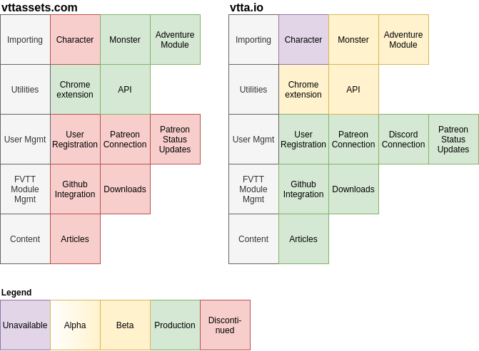

# Status Report

  <i class="wrench icon"></i>
  

    

      Maintenance
    

    
<strong>The following services are currently in maintenance mode:</strong>

    <ul>
      <li>Parser</li>
    </ul>
    
<strong>Details</strong>

    
Chrome Extension v1.0.4 slightly changes communication protocol it uses when messaging to the parser, therefore it requires an update, too. I will shut down the Parser now and apply the necessary updates along some other fixes (memory leaks, Discord connection issues and other smaller things) in order to make both components available in sync.
    

    
In the past, approval processes took between 2-3 days and 24h have already passed since submitting the extension. I therefore think that the maintenance won't take too long. This said, I don't know if COVID lengthens the approval process, initial review took 5 days/response, but the hurdle to get into the Store should be higher than providing an update.

    
I will announce any updates on this page as soon as I get it.

    
<strong>Thank you for your understanding and patience!</strong>

  

In order to not disrupt the current toolset, there's a new server, a new domain and a new toolchain in development that will make everything like... gorgeous and wonderful! Let's have a look at the features and where we stand:

- **Unavailable** - design phase, planned features
- **Alpha** - transitioning from the design phase into an early proof-of-concept/ evaluation phase to finalize the design and prototype it for internal use
- **Beta** - available to you to test-drive them
- **Production** - used as the default building block in production
- **Discontinued** - discontinued, unmaintained

As you can see, I am running both pages in parallel. This ensures non-disruptive usability of the current toolset without me needing to worry to break these because of necessary changes. I will update this post regularly to let you know what is happening and create dev diary posts to explain any design decisions made.

**[Update 1]** As of this update, the image is still true, but we got some color shifts since the last posts:

**If you want to import all the adventure modules as before**, then use the old line of tools:

- Chrome Extension: [Link to the Web Store](https://chrome.google.com/webstore/detail/vttassets-dd-beyond-found/mhbmahbbdgmmhbbfjbojneimkbkamoji)
- Foundry VTT modules: [Link to vttassets.com, download page](https://www.vttassets.com/assets/vtta-dndbeyond)

**If you want to use the new tools, which additional features, bells and whistles**, then use the new line of tools:

- Chrome Extension: [Link to the Web Store](https://chrome.google.com/webstore/detail/vttaio-dd-beyond-integrat/jkcgfhmpepgnjkjhgkfbengiopmbbhjj)
- Foundry VTT modules: [vtta-ddb](https://www.vtta.io/assets/vtta-core) and [vtta-core](https://www.vtta.io/assets/vtta-core)

**In both cases** please join the new Discord server:

- Discord server: [https://discord.vtta.io](https://discord.vtta.io)

## Roadmap

I am planning to tackle the following features and issues during the next weeks, with their respective priorities:

1. **Bringing stability into the toolchain** - roughly 30.000 lines of code are powering your new imports, from A to B. This does not include any tools I am using internally to prepare the processing instructions for the module import, the parser checks and revisioning, but just that: Chrome extension, modules and necessary infrastructure codes. Yes, _Lines of Code_ is not great measurement tool since I can write complex code in one line and the same thing very verbose in 20 lines of code, but it can still serve as an image: These tools and the way they work together are complex and I will need some time to make the engine go _brrrmmmm_. Bear with me, please.
2. **Porting the scene data into the new format** - and create the processing instructions individual to each adventure/ source book in order to make it available, too. We already have a great base of data, but it's still a manual effort to polish that and transfer it over to the new importer. I received initial feedback during the launch streams which modules to prioritize, but expect a formal Patreon poll soon.
3. **Add additional features currently missing** - references from monster character sheets to D&D Beyond, individual import of paragraphs or sections from D&D Beyond into Foundry VTT as Journal entries (think: custom digital DM-screen) and other things that will become an approved feature request.

## Current State

- The parser is running into memory leaks which are investigated. A couple of hundred users using a tool really makes those visible, my mere single-handed tests cannot make those pop. I already fixed one of the leaks and will ramp up the versions of all used libraries to improve the situation further

> **IMPORTANT NOTE: 03-22-2021**
> I made some necessary changes to the Chrome extension and submitted the update to the Google review team.
> This version will change the way it communicates with the parser all so slighty, requiring the parser to be updated, too. In order to be able to make these changes synchronously and in a tested and validating manner, **I will be taking the parser offline later tonight**, wait for the Google approval and then update the parser and bring everything back online again. I expect the parser to be online within the next two days.
>
> I am sorry to cause this initial interruption, thank you for your understanding!

- **Update 03-23-2021, 11pm** I found the root cause for the "Connect to Foundry" -> Timeout issue: It was rather harsh timeouts on the extension. It waited for 500ms, which is like forever in computers, until it gave up. That seems to be a bit tight for several setups that are not idling Foundry VTT servers and almost pristine Google Chrome browser like on my dev environment! I am allowing more time to connect until giving up and that seems to do the trick. Several people already tested a dev version of the extension to great success!

  This will be **avaiable in Chrome extension v1.0.5**, since v1.0.4 is already submitted for review and that is a process I cannot cancel. Bummer.

  ~~I am still investigating why some people are having a hard time to connect the Chrome extension to Foundry VTT. Thank you for all offering me access to their servers in order to replicate the issue, because for the hell of it: I cannot reproduce it even in the slightest. Some reports mention other extensions being in the way and after disabling them helped, but I cannot imagine how they could actually do that. I will keep you posted.~~

- The first update for vtta-ddb is already tested internally and will be released alongside the Chrome extension update, too. It will bring a couple of features already from Discord members, namely a more concise folder structure generated for monsters, items, rolltables and scenes. Until I have been porting over more adventures and created their processing instructions, I am relucant to give up one of a maximum of three folder depths for Journal Entries yet, though.

## This post will get updated

Please use this post as reference to check what is currently going on. Discord keeps rushing through all chats, and Patreon posts are volatile, too. This page stays forever ;)
