# Virtual Tabletop Assets - Tokens

VTTA Tokens is not just an update to vtta-tokenizer , but a complete replacement. Many of the features of vtta-tokenizer came late to the party and felt sometimes very clunky because of limitations of the base code, this is especially true when dealing with large resolution actor images, wildcard tokens and other features that were stacked on top of the code base which was never designed to provide such features.

Delete vtta-tokenizer. Use **VTTA Tokens** instead.

## Features

- **Layer-based composition tool** - create as many layers as you want and apply transparency and blend mode to each of them individually
- **"Lossless" composition** - the end result will be saved in the configured resolution, but behind the scenes, all added layers are processed with their native resolution. That way, your profile image is as crisp as it can be. **Note**: Due to that, working with a large amount of layers containing high-resolution images can be a hit on performance.
- **Improved masking algorithm** - The new algorithm works better with token frames that have a semi-transparent drop-shadow on the outer side of the frame: It is using a raytracing algorithm to detect the inner edges of the token frame
- **Use multiple masks** - Instead of providing and using just one mask, you can create a mask based on each existing layer. This allows to create compositions not possible with vtta-tokenizer.
- **Easily tint your token** - Adding tint layers allows to tint all or (if masked) some portions of your token with easily to select colors
- **Transform multiple layers at the same time** - rotation, scaling and translations affect all unlocked layers instead of just moving them individually. **Note**: Due to working with native resolutions per layer, there will be shifts caused by rounding errors when translating multiple layers at once. This is a known limitation and not necessarily a bug.
- **Additional tools**: Quickly create a new layer based on an existing one and mirror individual layers to really select the nicest composition possible
- **Use images from every source**: Drag&drop images from your computer, use images stored on your FVTT server or load any image from the internet (see footnote below)

### Footnotes

Loading images directly from a URL is made possible by using a CORS proxy. While being publicly available now, this will change in the future due to liability reasons. You will be able to use the VTTA proxy if a patreon or you will need to setup and configure your own proxy in order to use this functionality when the restrictions will take effect. Instructions on how to setup your own proxy will follow.

# Introduction

Creating a token is - when using only the basic features of VTTA Tokens - very straight forward. There is an additional header button in the character sheet: **VTTA Tokens**. Clicking on it opens the editor:

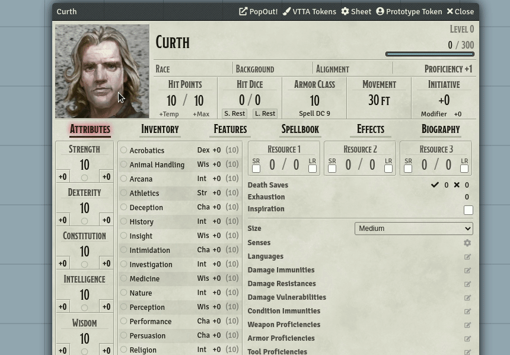

The editor is split into a **preview pane** on the left, showing the resulting composition and a **control pane** on the right, providing all the tools necessary to create stunning token images.

## Basic transformations

You **transform all unlocked layers** by using mouse and keyboard combinations while hovering over the preview pane. Try these combinations:

- **Translate** all unlocked layers by holding down the left mouse button and moving the mouse
- **Scale** all unlocked layers by using your mousewheel
- **Rotate** all unlocked layers by holding SHIFT and using your mousewheel

Scrolling your mousewheel slower will provide more control of the result, scrolling fast will change the transformations more rapidly.

All unlocked layers will be transformed using your inputs. Let's try to apply all transformations to the frame layer and the profile layer at the same time:

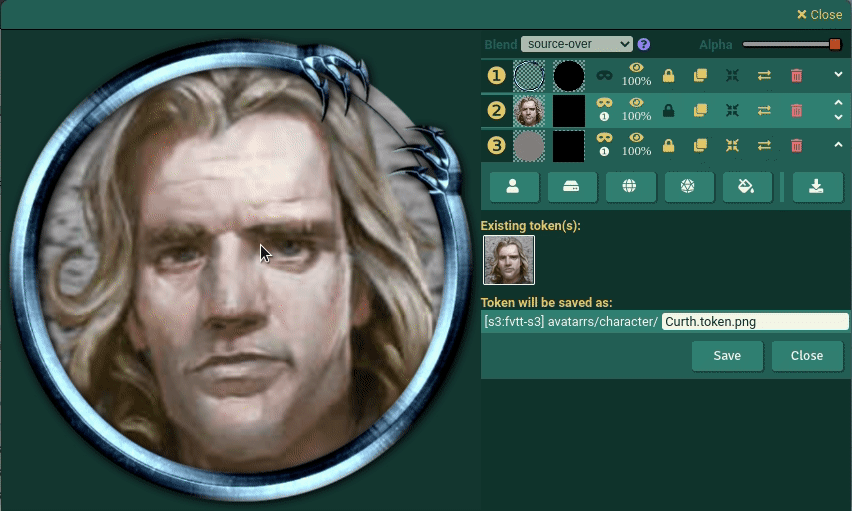

## Understanding layers

When you open up the editor you will see that three layers will be added by default:

- Layer number ① is the configured basic token frame for this type of actor
- Layer number ② is the actor's profile image
- Layer number ③ is a tint layer based on the average border color of the actor's profile image

When drawing the composition, the editor starts at the bottom layer, ie. the layer with the highest layer number. This layer is drawn first on the initially transparent canvas, then the layer above that one until the top-most layer with the number ① is reached.

Therefore, in the basic configuration, the tint layer calculated on the actor's profile image is drawn onto the stage, then the actor's profile image itself and lastly, the default token frame is put on top of that. **But wait!** If all of those input images are rectangular, why is the resulting shape round? Because we are using **Masks**:

## Masking

Let's take a blank canvas to start with and then draw an image onto it. Per default, the whole image will be drawn on that canvas, filling a rectangular shape. We cannot take a scissor (technically speaking) and simply cut off parts of the profile image, because in digital worlds, images are always rectangular shapes with a given width and a given height. But we can use a trick:

Let's draw a black circle on the canvas first, and then the profile image but with the added calculation: Take the existing pixel on the canvas and the pixel of the

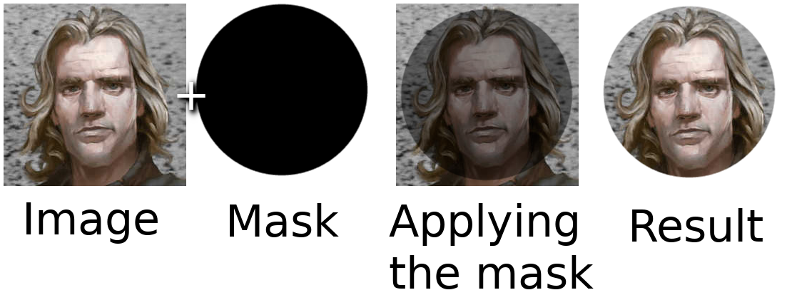

Let's take a clean, rectangular canvas to draw that circular profile image onto. First, we will draw the mask on the canvas which in our case is a black circle. Then we will draw our profile image onto the same canvas, but we will only draw the pixels that are lining up with the circle by comparing pixel by pixel: If the target canvas' pixel is black, we will draw the profile image pixel, if not we will not draw that pixel at all.

The easiests masks are either fully transparent: Then nothing at all is drawn from the masked image - or fully opaque/black: Then the whole image is drawn without any restrictions.

### Generated masks

The token editor generates masks for all layers that get added and you can choose which mask to apply for each layer individually. By default, the circular shape of the default token frame seems the best bet. Therefore, the mask of layer ① is applied to both the profile layer and the underlying tint layer, too: The result is a circular token per default with minimal required user interaction.

# Understanding the user interface

With an understanding about what masks are and how we can use them, let's go over the individual controls shown for each layer. You can always hover over a contorl with your mouse to show a tiny help text, too:

## Basic controls

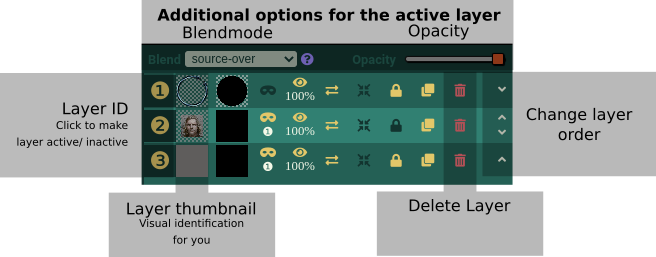

The **layer ID** is on the very left. You can click this number (①, ②, ③ ...) in order to activate the corresponding layer and to enable the upper area, described as "Additional options for the active layer". Use this portion of the screen to adjust the **blendmode** and the **opactiy** of the active layer.

Next to the layer ID is a **thumbnail** of the layer. It helps you to visually identify the layer you are about to adjust.

On the right side you can see controls for deleting the layer and for re-ordering the layers. Remember: The layer with ID ① is drawn on the very top of the resulting image, and you might want to influence the order of the layers to achieve specific results.

At the top you see additional options only accessible of one layer is active. You can activate a layer by clicking on the Layer ID on the very left, and after activation, you can adjust the blend mode and the opacity (see below) of this layer.

## Basic controls (continued)

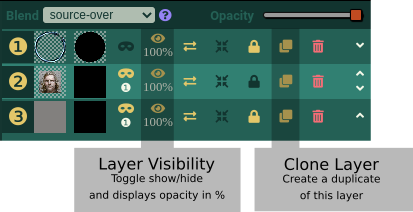

The visibility control allows to toggle a layer as hidden or shown by clicking on the eye-icon. Right below you can see the opacity value this layer is set to. Remember that you can only adjust the opacity after making said layer active by clicking on it's layer ID and then adjusting the slider in the active layer options at the top of this window.

The last control in this basic section is the **clone** tool. This allows for easy duplicating of a specific layer, most commonly used when trying to apply advanced masking of the existing image.

## Mask-specific controls

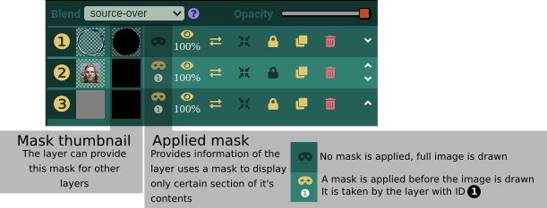

Next to the layer thumbnail are the two controls related to masks: The left one is a thumbnail of the mask that is **provided by this layer**. Provisioning a layer must not necessarily mean that any layer applies this layer, only that it is available.

Applying a layer's mask to a layer is done with the remaining control. It can be one of two states:

1. If is either a greyed out mask, meaning: I am not consuming any mask, please draw me as is and do not hide anything from my pixels.
2. The mask icon can be of goldish color, and underneath it is a circled number. That means: "Please apply a mask to me before drawing, and please use the mask of the layer with ID n."

In the image above, layer ① has no mask applied, but the layers ② and ③ have the mask from layer ① applied. This is the default behaviour.

## Transformation-specific controls

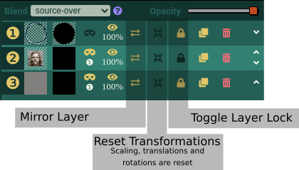

This section contains controls related to transformations. Remember that you can scale, rotate and translate each unlocked layer by using mouse and keyboard-combinations while hovering over the preview pane. Using the lock control, you can specify which layers are affected by these operations.

The mirror tool let you flip the layer on it's vertical axis which is great for quickly creating at least a small degree of variation when creating wildcard tokens.

The last tool resets all transformations back to the default.

## Adding layers

You can easily add layers from all thinkable sources using the toolbar right below the layer controls:

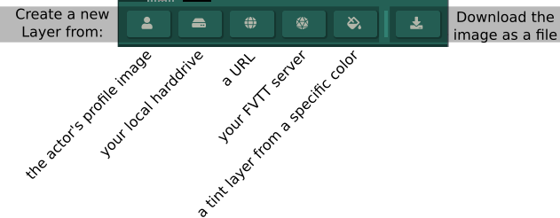

You can add a new layer

1. from the actor's profile image
2. from your local harddrive
3. from a given URL (see footnote)
4. from your FVTT server or
5. by selecting a color from a color picker and adding the new layer as a tint layer

Depending on your choice, different modal dialogues will help you to add the new layers, e.g. the modal for selecting a file from your hard drive will provide a drag and drop interface for easily dragging one or multiple images at once. Each image will result in one seperate layer:

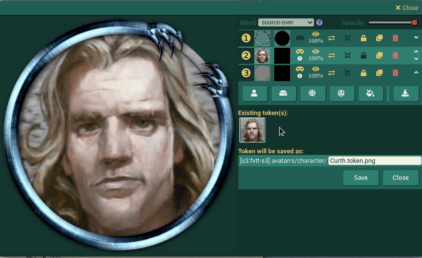

Furthermore, you can now easily download the image directly from within the editor by selecting the appropriate button at the very right of this control.

## Saving the token

In the lower right of the window, you can see all the information necessary to decide where the generated token will be saved to. In the upper section, you will see the configured tokens for this actor as preview images. If the actor has wildcard tokens enabled all valid tokens for this actor will be displayed here. Hovering over those preview images with your mouse will bring up their respective filename as orientation for you, too.

Just below, you will find both the folder and the filename that VTTA Tokens figured out for you. Let's have a look on how this is actually decided:

### How does VTTA Tokens decide where to store the token?

First, it will try to save the token right next to the actor's profile image, with an added `.token` suffix appended to the original filename. E.g. if your actor's profile image is located at `[data] images/uploads/my-actor.jpg` it will try to save it to `[data] images/uploads/my-actor.token.jpg` (Note: It will save the token always as a PNG, but will name it according to the actor to maintain best correlation to this filename).

The module might not be able to save the token at that location. If you e.g. have stored the actor's profile image directly in the root directory of the user data storage (`[data]` without any path following), this is not an allowed target for modules to uplaod files too since one of the latest Foundry releases. Or you might have just inserted any image URL from a remote webserver as the actor image: Surely we cannot save the token at a remote webserver ;)

If VTTA Tokens finds such an inaccessible target, it instead generates a new filename, based on the "Target directory for actor-related images" in the Shared settings section of all VTTA modules:

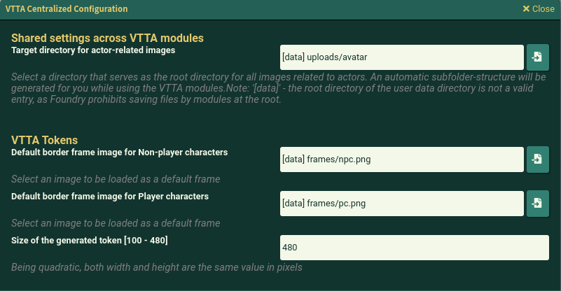

Beneath that configured directory, it will create a subdirectory structure for better image management for you while saving the token. Let's assume the depicted storage location `[data] uploads/avatars` for the following examples:

- For player characters, it will store the token in `[data] uploads/avatars/character/actorname.token.png`
- For non-player characters (NPCs), it will store the token in `[data] uploads/avatars/npc/[actor-type]/actorname.token.png`, where `[actortype]` is the actor's type, e.g. "dragon", "construct", "human" etc.

### Editing the filename

While the path is non-editable before saving the token, you can certainly edit the filename of the token. This is useful if you do not want to overwrite the existing token, but instead want to create a new file.

### VTTA Tokens will overwrite existing images

If the algorithm determining the best filename or your manual edits come up with a filename and if a file exists at that filename, it will be overwritten without hesitation. This is necessary to actually update the token for an existing actor, and it surely requires a little attention of you as a user. Because of that, the currently used token image is displayed as a thumbnail to increase your ability to decide wether to overwrite, rename the destination filename or skip the operation.

# Advanced usage: Wildcard tokens

Wildcard tokens is something many users don't even know about, but it's a fairly easy and powerful way to increase atmosphere. Imagine your party encountering seven goblins. You will start dragging the goblin token onto the scene and every goblin looks identical to his brethren. Now imagine that FVTT will draw a token image from a set of possible images and you will get a more diverse scenery (plus your party can actually say "I am hitting the ugly one with my hammer" instead of "the one on the left.. no, not this one, the other left, yeah, the one next to the stone").

To create wildcard token images, you will need to enable it in the **Prototype token** configuration of the actor first. Enabling it requires two settings to be adjusted:

1. The token filename must contain an asterisk: `uploads/avatar/goblin-*.png`. That means that all of these filenames are valid targets:

- `uploads/avatar/goblin-01.png`
- `uploads/avatar/goblin-a.png`
- `uploads/avatar/goblin-theuglyone.png`
- `uploads/avatar/goblin-999.png`
- `uploads/avatar/goblin-hardhitter.png`

2. You will need to check the `Randomize Wildcard Images` options right bewlow the **Token Image Path**. The following screenshot shows a valid configuration:

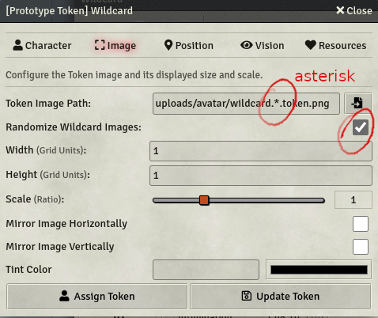

**Note**: This setting is FVTT-controlled. Whenever you encounter a filename/ directory name in the following format: `[data] some/path/some-image.png`, `[public] some/path/some-image.png` or `[s3:mybucket] some/path/some-image.png` then you are seeing a format only VTTA modules generate and use. This format is not a valid **Token Image Path** in this dialog. Just use the filepicker to select a possible image token and manually insert the asterisk at a suitable position.

With that configuration done, open up Tokenizer to generate some variation tokens:

You see that VTTA Tokens generated the first token filename by replacing your asterisk with the number **001**. Adjust your token as needed and hit **Save**. Instead of closing the window, it now adds the generated token to the token preview pane, generates the next filename and awaits your next **Save** command. Repeat the steps until satisfied and close the window using the **Close** button below.

You can of course use any of the editing abilities of VTTA Tokens to create more diverse tokens: Upload different images and hide/ delete all used ones. Mirror images and scale/rotate them a little bit to create the illusion of diversity until you are satisfied with the results.

# Advanced usage: Mask editing

Sometimes, the masking algorithm does not work well with more sophisticated border frames. Or you simply want to enter the world of image compositions that go a step beyond the basic usage scenario of VTTA Tokens. In these cases, you can always **click on the mask thumbnail** in the layer's control which brings up the fullscreen mask editor:

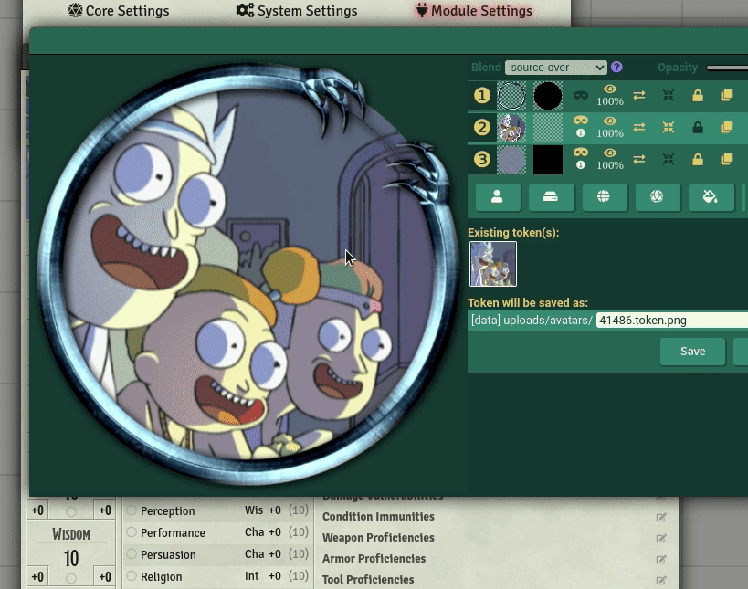

This token frame is has a detail at the top right that is not detected greatly by the algorithm as the thin line is too thin and almost every pixel is beyond the treshhold to detect opaque borders. By clicking on the mask thumbnail of the frame layer (the layer that provides the mask for both the actor's profile image and the tint layer), the mask editor pops into view.

You can now paint the mask with your mouse. Regular left-clicks add to the mask, but when you hold Shift at the same time you remove parts of the mask. Use your mousewheel to adjust the brush size to get all those fine details done.

Out of screen (but I promise: it's there!), you will have a "Ok, save this mask", or "Oh my gosh, I only made it worse"-Cancel buttons that will bring you back to the main screen.

# Caveats

Working with S3-compatible storage solutions is great, but contains the risk for misbehavior. I tested VTTA Tokens successfully with S3 storage provided by DigitalOcean, but not with AWS or other providers. I have setup my S3 storage to provide a single bucket and the resulting DNS name for each ressource has the bucket name as a subdomain name included:

`https://[myBucket].[myS3host].com/[myResourceURL]` works for me. I know that some other hosts attach the bucket name as a subfolder - as I need to deduct the storage location based on URL, that will probably break things.

So S3 support comes with a "Can work, but that's not a guarantee" disclaimer. If this mod breaks your storage, I cannot be held responsible ;)
