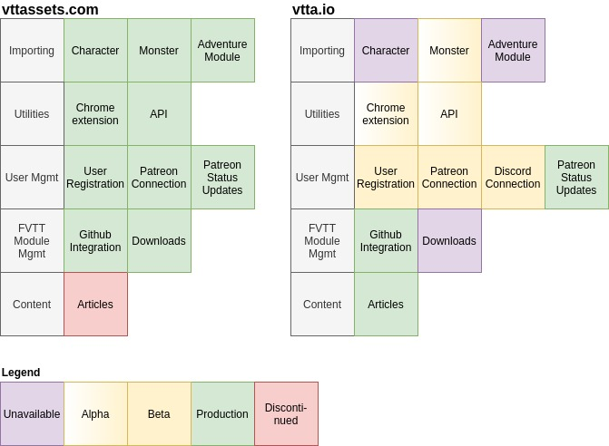

# vtta.io is live!

In order to not disrupt the current toolset, there's a new server, a new domain and a new toolchain in development that will make everything like... gorgeous and wonderful! Let's have a look at the features and where we stand:

- **Unavailable** - design phase, planned features
- **Alpha** - transitioning from the design phase into an early proof-of-concept/ evaluation phase to finalize the design and prototype it for internal use
- **Beta** - available to you to test-drive them
- **Production** - used as the default building block in production
- **Discontinued** - discontinued, unmaintained

As you can see, I am running both pages in parallel. This ensures non-disruptive usability of the current toolset without me needing to worry to break these because of necessary changes. I will update this post regularly to let you know what is happening and create dev diary posts to explain any design decisions made.

## Content

You will find all new content only on vtta.io, vttassets.com will not receive any updates in that part. Indeed if you find any spelling errors or want to correct my weird english, you can do so: The content part of the webpage is [available on GitHub](https://github.com/VTTAssets/vtta.io). It's easy to write new articles, so if you have any interesting topic, give it a try! Just use the Jitsi article as a template, make sure you have a Gravatar assigned to your email and make a contribution!

## FVTT Module Management

New releases of the modules will be made available on both sites simultaneously. The assets shown on vtta.io are not downloadable and are lacking descriptions

## User Management

Since the Chrome extension that is currently in production uses the user information from vttassets.com, you will still need to follow the steps [depicted here](https://www.vttassets.com/chrome-extension) in order to unlock your Patreon mode. Please feel free to register at vtta.io and connect/ disconnect your accounts to ensure that everything is working correctly here. Patreon status is updated to both sides, therefore any feedback regarding these features on vtta.io is appreciated.

## Utilities

Both the Chrome extension and the API are running still running on vttassets.com. The new extension is currently in development and will enter beta in due time.

## Importing

Closely related to the Chrome extension and the API, these features will enter beta alongside those components. Right now, I am working on the monster parser and the whole process of versioning the monster parses, depicting updateable imports for you and refining the design of the general import mechanisms.

# Get cracking, lazy bum!
*"I can do that. Work, work."*

